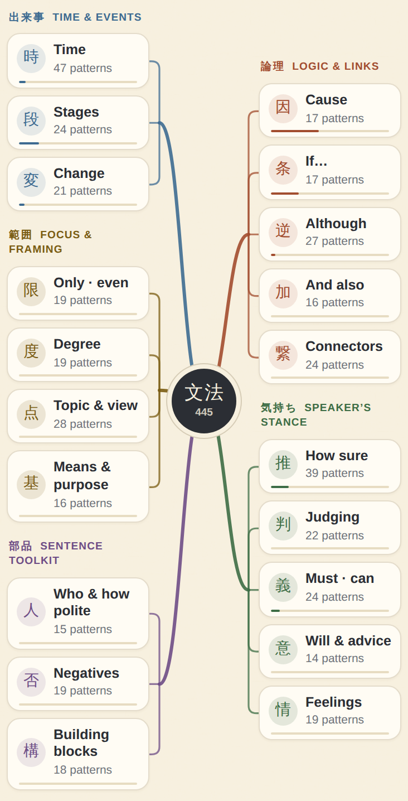
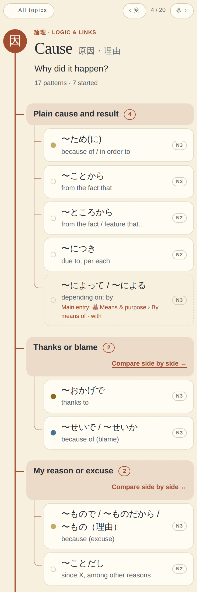
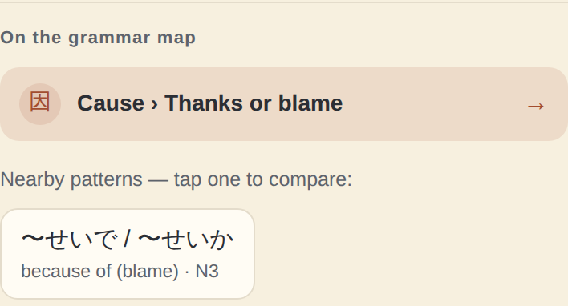
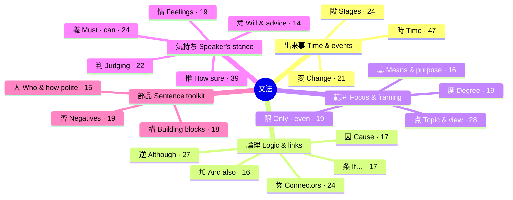

# 筋道 · Sujimichi — N3/N2 grammar in English and Thai

A small study app for Japanese grammar at JLPT N3 and N2 level, written for
English and Thai speakers. It runs entirely in the browser: no account, no
server, and it works offline once opened. Progress stays on your device.

**Uploading this app to GitHub?** Follow [UPLOAD.md](UPLOAD.md).

<table>
  <tr>
    <td width="33%"></td>
    <td width="33%"></td>
    <td width="33%"></td>
  </tr>
  <tr>
    <td>The grammar map: every pattern sorted by what it lets you say</td>
    <td>A topic opens as a tree: branch → patterns, with strength dots</td>
    <td>Every lesson shows where it sits and what is nearby</td>
  </tr>
</table>

## The three tabs

| Tab | What you do there |
| --- | --- |
| **Study** | Press **Start today's study**. The app reviews what is due, then teaches new patterns one at a time, in short sessions of up to six steps. Below it is an optional **Random JLPT drill**. |
| **Library** | The **grammar map** (all 445 patterns by meaning), a searchable **list**, side-by-side **comparisons** of look-alike grammar, a word-form guide and the Shin Kanzen book checklist. |
| **Progress** | Review levels, a 7-day forecast, progress by map topic, settings, and your **backup**. |

The level buttons at the top (N3 + N2 · N3 · N2) filter everything. New
installs start on N2.

## The grammar map

Textbooks list grammar chapter by chapter. The map instead asks **"what do
you want to say?"** and puts every pattern in exactly one place:

- **5 regions**, one colour each
- **20 topics** (Time, Cause, If…, How sure, Must · can, …)
- **96 branches** that group patterns doing the same job. For example,
  *Cause › Thanks or blame* holds おかげで and せいで.

Tap a topic to see all its patterns with their meaning, level and strength.
Branches whose patterns are easy to confuse link to a side-by-side comparison
table. Each lesson ends with **On the grammar map**: where it lives, its
neighbours, and any second meaning filed elsewhere (ため is both *Cause* and
*Purpose*). The List view, search and the Progress tab use the same topics.



## How studying works

- **Learn, then use it at once.** A new pattern is a short card (01 Meaning ·
  02 Build it · 03 One example), followed straight away by practice with that
  pattern. Example sentences highlight the grammar.
- **Reviews** follow a simple ladder of 1, 3, 7 and 21 days. A level can rise
  at most once per study day. A wrong answer never raises it.
- **Help is fine, but it counts as help.** Later reviews ask you to type the
  missing grammar first. Opening the choices, hints or answers marks the
  attempt as assisted, and the card comes back.
- **Repair list.** Missed practice questions return until you answer them
  unaided on a later day.
- **Random JLPT drill.** Rounds of up to 10 questions from a bank of 118 N2
  questions (44 official, 74 original). You choose *Encountered in Study* or
  *All*. Drills never change review levels.
- Scores are study aids, not predicted JLPT results.

## What's inside

| Content | Amount |
| --- | --- |
| Library entries | 445 (193 N3, 252 N2), each with EN/TH meaning, connection, notes and 2+ examples (907 in all) |
| Grammar map | 5 regions · 20 topics · 96 branches, every entry placed once |
| Structured short lessons | 47 |
| Comparison tables | 12, with 58 rows ("same translation, different use") |
| Authored practice | 55 exercises: 27 form, 24 contrast, 4 recall |
| JLPT-style questions | 153 in total. N2: 118 (44 official + 74 original), made up of 88 sentence gaps, 16 ★ sentence-order questions and 14 passage blanks |
| Book checklist | Shin Kanzen Master N2: 26 chapters + 3 supplements, 156 rows → 171 lessons |

Sources, corrections and the limits of the content review are in
[CONTENT-SOURCES.md](CONTENT-SOURCES.md). The official questions come from the
JLPT's published N2 workbooks (2012 and 2018). English/Thai explanations are
the app's own.

## Run it on your computer

You need [Node.js](https://nodejs.org). There is no build step and nothing to
install.

```bash
node build/serve.cjs 8775
```

Then open **http://127.0.0.1:8775**. Use the server, not a double-click on
`index.html`: offline mode and "Add to Home Screen" need a real `http://`
address.

## Put it online (GitHub Pages)

In the repository: **Settings → Pages → Deploy from a branch → `main` /
(root)**. All paths are relative, so it works at `username.github.io/repo/`.

Whenever you change the app, **bump `CACHE` in `sw.js`** so phones download the
new version. Updating files never erases anyone's progress.

## Add to Home Screen

- **iPhone:** open in Safari → Share → Add to Home Screen.
- **Android:** Chrome menu → Install app.

## Your progress and backups

Progress lives in this browser's storage, separately for each device and web
address. It does not move by itself, and clearing browser data erases it.

- **Progress → Download progress backup** saves a JSON file.
- To restore, tap **Restore**, paste the file's text, and tap **Restore** again.
- Invalid backups are rejected before anything changes. Older backups (v4–v7)
  still load.

## Tests

The unit tests need only Node:

```bash
node --test tests/legacy.test.cjs tests/mastery.test.cjs tests/simplify.test.cjs tests/jlpt.test.cjs tests/official.test.cjs tests/map.test.cjs
```

These 54 tests cover scheduling and migrations, backups, the one-button Study
flow, drill scope and passages, the official answer keys, and the grammar map
(every entry placed once, search, level filter, lesson links). They also check
example highlighting and the study-day forecast.

The browser suites need Playwright. Start the server first, then run:

```bash
node tests/browser-smoke.cjs     # study flow, comparisons, backup, dark mode, offline
node tests/jlpt-browser.cjs      # random drill formats, scopes, resume, offline
node tests/official-browser.cjs  # official questions, sources, passages
node tests/map-browser.cjs       # map, topics, lesson links, search, Progress, offline
```

`BROWSER_CHANNEL` selects the browser (default `chrome`; use `chromium` for
Playwright's own build). `TEST_URL` changes the address, and `PLAYWRIGHT_PATH`
points at a Playwright install outside Node's normal search path. Automated
checks do not replace a human review of the Japanese.

## Files

```
index.html            app shell, core library data and the daily review queue
grammar-expansion.js  added and corrected lessons, Shin Kanzen chapter links
n2-exam-lessons.js    nine support lessons for N2 exam structures
lesson-guides.js      47 structured short lessons
comparison-guides.js  12 comparison tables
mastery-content.js    authored exercises, form guides
jlpt-content.js       61 original JLPT-style questions (N3, N2 and mixed)
jlpt-official.js      44 official N2 questions with source links
jlpt-n2-practice.js   48 more original N2 questions
map-content.js        the grammar map: regions, topics, branches
mastery.js            practice sessions, repair list, backups
simple.js             Study flow, lesson cards, example highlighting
jlpt.js               random drill and typed daily recall
map.js                map, topic trees, list grouping, lesson and Progress links
*.css                 styles (mastery, simple, jlpt, map)
sw.js                 offline cache — bump CACHE on every release
manifest.json         Add to Home Screen metadata
icons/                app icons and the paper texture
build/                local servers and icon generators (not needed online)
tests/                unit and browser tests (not needed online)
docs/                 README screenshots
```

Keep `icons/`, `build/` and `tests/` as folders. If they end up flattened into
the top level, the icons and paper texture disappear, offline mode skips them,
and every test fails with `ENOENT`.

## Notes for maintainers

**Adding a grammar entry.** Give it a new, permanent ID (progress is stored
by ID), then place it in exactly one branch of `map-content.js`.
`tests/map.test.cjs` fails if an entry has no place on the map, or two.

**The daily queue.** `S.day` is today's ledger and the source of truth:

| field | meaning |
| --- | --- |
| `newIds` | patterns handed out as new today (never shrinks) |
| `learned` | new patterns you reached practice for |
| `done` | patterns rated today (except "again") |
| `extra` | extra allowance from earlier app versions |

`S.q`, the queue on screen, is only a view of that ledger. It is rebuilt when
the level, a setting or the day changes. A rebuild keeps the answered part and
re-plans the rest, so it never hands out a second batch of new cards.

**Icons.** The app icon and the growing plant come from one 16×16 pixel grid.
Regenerate with `perl build/make-icons.pl` and `perl build/make-paper.pl`.
Every PNG is the grid at a whole-number scale, so the pixels stay sharp.
